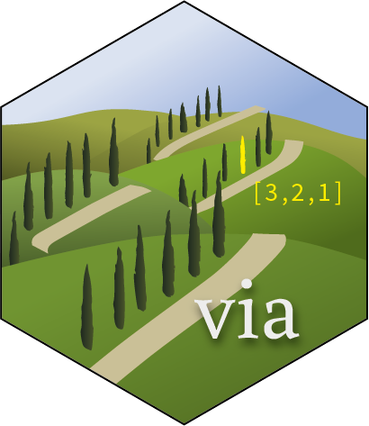

# via: Virtual Arrays for R 

## About

The package defines the base class VirtualArray, a wrapper around lists
that allow users to fold arbitrary sequential data into n-dimensional,
R-style virtual arrays. The derived VirtualArray class is defined to be
used for homogeneous lists that contain a single class of objects. The
RasterArray and SfArray classes enable the use of stacked spatial data
instead of lists.

This is a test site\!\!

-----

## Notes

#### History

The functions here were originally developed and published as part of
the [chronosphere](https://cran.r-project.org/package=chronosphere) R
package. For better compliance with [UNIX
philosophy](https://en.wikipedia.org/wiki/Unix_philosophy) and more
efficient distribution/development, the original chronosphere has been
broken up to three R packages:

  - `rgplates`: functions related to tectonic reconstructions.
  - `via`: Virtual Arrays for efficient organisation of high-dimenional
    data.
  - `chronosphere`: version-controlled data distribution.

This is a beta version, and like R, comes with absolutely no warranty.
